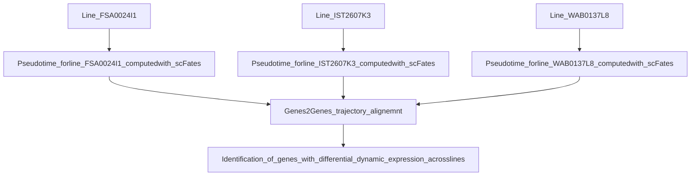

# _benchmarking_state-reproducibility

#### Authors: Maria Rosaria Nucera, Cal McCrimmon, Davide Vespasiani, Kaan Öcal, Trevor Atkeson.

### Aims:
- [x] Testing reproducibility of the pseudotime across the 3 different lines  (FSA0024I1, IST2607K3, WAB0137L8) using genes2genes to align and compare trajectories
- [x] Testing robustness to different criteria for the choice of the root (starting point of differentiation) based on expression of markers for pluripotency/other sets of markers
- [x] Testing what happens when the root starts from cells in a different cell cycle phase (G2M or S)
- [ ] Testing robustness to different number of cells x time point across the lines and whether this affects the trajectory or not

### Tools and functions used during the Hackathon
| Package/function | Function |   Example notebook |    
| ------------- | ------------- | ------------- |
|  [module_score(gene set)](https://scanpy.readthedocs.io/en/stable/generated/scanpy.tl.score_genes.html) | define start of trajectory | [stemness score](https://github.com/Oz-Single-Cell-2024-Hackathon/_benchmarking_state-reproducibility/blob/main/notebooks/root_choice.ipynb) |
|  [scFates](https://scfates.readthedocs.io/en/latest/) | compute pseudotime | [pseudotime on the whole dataset](https://github.com/Oz-Single-Cell-2024-Hackathon/_benchmarking_state-reproducibility/blob/main/notebooks/Hackathon_data_all.ipynb) |
|  [Genes2genes](https://github.com/Teichlab/Genes2Genes)| align pseudotime | [alignment pseudotime line1 and line2](https://github.com/Oz-Single-Cell-2024-Hackathon/_benchmarking_state-reproducibility/blob/main/notebooks/g2g.ipynb) |

### Workflow for Testing reproducibility of the pseudotime across the 3 different lines

[Pseudotime_forline_FSA0024I1_computedwith_scFates](https://github.com/Oz-Single-Cell-2024-Hackathon/_benchmarking_state-reproducibility/blob/main/notebooks/Hackathon2lines.ipynb)
[Pseudotime_forline_IST2607K3_computedwith_scFates](https://github.com/Oz-Single-Cell-2024-Hackathon/_benchmarking_state-reproducibility/blob/main/notebooks/Hackathon1lines.ipynb)

